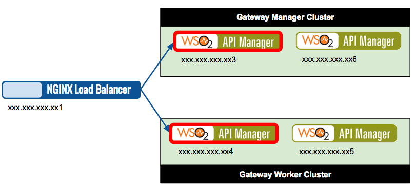
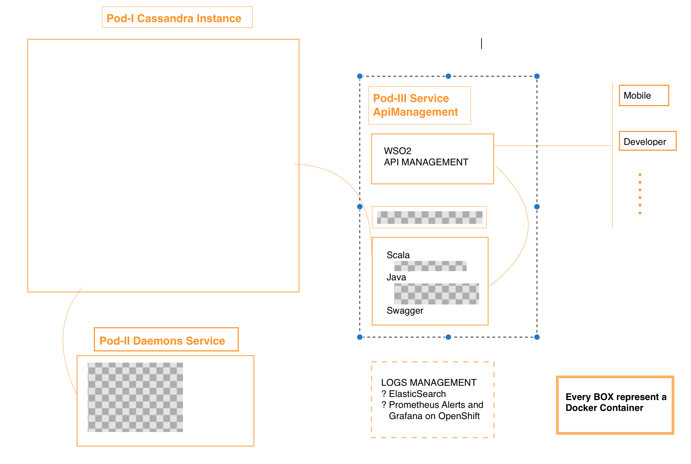

# Dockerizing WSO2 Api Manager #

WSO2 has its [WSO2 docker file documentation](https://docs.wso2.com/display/DF120/WSO2+Dockerfiles+Documentation). I've made a review and I do not like at least for WSO2AM.

Any way my first recommendation is ALLWAYS USE OFFICIAL IMAGES of course if it possible. I have test to many images from WSO2 
and the best perfomance is for [WSO2 official site](https://hub.docker.com/u/wso2/).

The problem: **The documentation is minimal or no documentation.**

**In this kind of product is very important to create a container with state, because you will spend too many time in its configuration and could losse sensible info**  
So before download the image and run it **pay attention in deep** about [how create Volumes](https://docs.docker.com/storage/) in docker:

We will show the basic procedure in which you don't have to worry about where to save our info:

```sh
# wso2scadip: it is a volume name in docker volume area
# /home/wso2carbon/wso2am-2.6.0/repository: it is the content into the container that we want to store in 
# the docker volume area

sudo docker run --name wso2test -v wso2scadip:/home/wso2carbon/wso2am-2.6.0/repository wso2/wso2am:2.6.0
```

Some reference about the API creation process:
[Creating API from scratch](https://docs.wso2.com/display/AM260/Quick+Start+Guide#QuickStartGuide-CreatinganAPIfromscratch):
- in step 4 you have to indicate the context 
- in the step 5 you have to indicate teh Production and Sandbox urls

So as I mentioned before in one step of our API creation process you have to indicate:

  Production URL: http://172.17.0.4:9000/apirest 
  
  Sandbox URL: http://172.17.0.4:9000/apirest

It means that when we make a request to an specific endpoint, WSO2 will redirect our request to our  **the Production URL** (http://172.17.0.4:9000/apirest) + the path to our service (/football/matchs). So finally we are talking about the context+the path that you can find in your restfull definition(It is independently of your restfull implementation).

If you try to test the aforementioned **Production URL** or **Sandbox URL** most of the time will fail DO NOT feel that someting is wrong and keep going. In my opinion I think that the Idea of this validation is wrong and too many developers spent some time trying to understand the malfunction (referring to external apis). So my recomendation is that you wait that the creation process finishes and then take a look to curl command that has been generated automatically.

## Clustering ##
In the process of clustering api manager, some important points when trying to look for info:

1. [Information related with clustering](https://docs.wso2.com/display/CLUSTER44x/Overview): Curiously the information about the last releases make references to earlier releases. The info is no very clear when they try to separate the 4 components and the explanation about [how configure them](https://docs.wso2.com/display/CLUSTER420/Clustering+API+Manager) and prone to errors.
2. H2 database that come with WSO2 is [NOT recommended in production environment](https://docs.wso2.com/display/CLUSTER44x/Setting+up+the+Database). 
3. In what escenarios is recommended clustering WSO2 product. What does it mean in the following image in your [clustering documentation page](https://docs.wso2.com/display/CLUSTER44x/Clustering+the+Gateway):
   

I recommend a very [good article](https://dzone.com/articles/understanding-wso2-api-manager-deployment-patterns-1) that explain in a very good manner clustering and how make viable autoscaling in WSO2AM. 

### Some queries: ###

1. What files/folder should be saved  if we need a WSO2 backup implementation?
2. Is not clear if we need to use ENV var in our WSO2 AM, for example when we need to configure our Production URL and It is dynamic.
4. If it not possible the use of dns in our address because the use of Hazelcast so what happen with all of our dynamic address that we need to use? Do we need to start our containers every time that any other referenced address change. 

## Unknown procedures while dockerizing ##

Some of the most important aspect that are no clear when I deploy WSO2 in a docker container:

1. Dealing with the WSO2 configuration when I run a container from ([WSO2 official site](https://hub.docker.com/u/wso2/)):

   - We create docker container **with volumes** BUT in producction environment we need several changes like:
       1. databases: **H2 DB => Postgree/Msql/other databases**. 
       2. [Configuring cache](https://docs.wso2.com/display/AM260/Configuring+Caching) it means modify files: <PRODUCT_HOME>/repository/conf/carbon.xml, <API-M_HOME>/repository/conf/api-manager.xml, etc. 
       So we need to use one of the different ways to provide this file to the container (via short Dockerfile with FROM + COPY, via Docker Configs, via runtime bind-mount, etc) and ***at the same time we have to make the installation on the container and  trusting that everything is persisted in the created volume. So if the container is deleted and we have to create it from the image again  we can have the information previously saved (mysql installation, user passwords, roles,apis info, etc)***
     
2. Architectural patterns: 
   - For apply autoscalling you mean that WSO2AM components must be distributed(clustering) or at least its most critical components(Gateway, Key Manager, Traffic Manager) to allow autoscalling.
   - In my case I am planning all-in-one deployment, at least for the beginning considering a **low traffic requeriment(<1000tps)**, it isn't in your official documentation. So I guess that all-in-one deployment doesn't have any problem when scalling all POD(include several containers).In my case I am talking about a container with WSO2AM that will manage Apis that are in other containers and of course are externals to your WSO2 platform(Not deployed on WSO2 application server). ***see image below with a POD (POD-III Service ApiManagement contains 2 containers(1 for WSO2AM and 1 for the External API))*** 
   - It is not clear how make balancing NGINX in WSO2, [at least in your official explanations (manager/worker)](https://docs.wso2.com/display/CLUSTER44x/Clustering+the+Gateway). In an **all-in-one deployment** WSO2AM should be in container and external RESTAPI in other container BUT both container in the same POD and our NGINX load balancer in front of the 2 POD replicas, for example.


